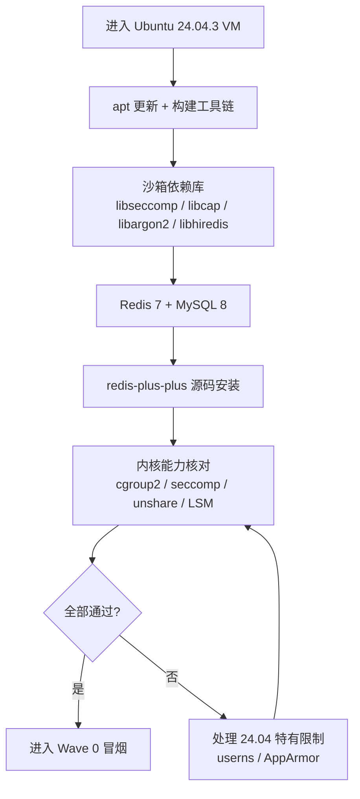

# 环境配置手册（方案 C：现有 Ubuntu 24.04.3 虚拟机）

> **对应**：《第三版执行计划》「零点五 开发环境适配」与「Wave 0 环境验证」。
> **前提**：沿用《环境体检.md》第七节的复检结论——本机已有 **VMware Workstation 17.6 + 运行中的 Ubuntu 24.04.3 VM**，不再新建环境。
> **原则**：本手册只写"在 VM 内执行"的命令；凡未实测处均标注「待实测」，不把记忆当证据。

---

## 0. 决策：为什么用方案 C 而不是 WSL2

| 方案 | 落地成本 | 结论 |
|---|---|---|
| A. WSL2（计划推荐） | 需管理员 + 重启 | 备选，非必需 |
| B. Docker Desktop | 适合 Wave 5 | 推迟 |
| **C. VMware + Ubuntu 24.04.3 VM** | **已具备，零成本** | **采用** |

**版本偏差已知并接受**：计划基线为 Ubuntu 22.04（g++ 11.4 / glibc 2.35），现成 VM 为 24.04.3（预计 g++ 13 / glibc 2.39）。差异**不影响方法论**——计划任务 0.4 本就用 `strace` 实测生成白名单，不依赖特定编译器版本。偏差记入计划「零点五」即可。



---

## 1. 进入 VM 并核对现状

在 VMware 窗口里打开 Ubuntu 终端（或配好 SSH 后从宿主连）。

```bash
lsb_release -a          # 期望 Ubuntu 24.04.3 LTS
uname -r                # 记下内核版本
nproc; free -h; df -h / # 资源余量：CPU / 内存 / 根分区
```

> **先记基线**。后面所有"通过/不通过"的判据都相对这个基线，别跳过。

---

## 2. 系统更新 + 构建工具链

```bash
sudo apt update && sudo apt upgrade -y
sudo apt install -y build-essential cmake ninja-build git curl pkg-config
```

核对：

```bash
g++ --version      # 24.04 预计为 13.x（待实测）
cmake --version    # 期望 ≥ 3.22（24.04 预计 3.28）
ninja --version
```

> 若确需对齐 22.04 的 g++ 11，可另装 `g++-11` 并用 `update-alternatives` 切换；但**不推荐**——沙箱白名单靠实测，工具链版本不是硬约束。

---

## 3. 沙箱依赖库

```bash
sudo apt install -y libseccomp-dev libcap-dev libargon2-dev libhiredis-dev
```

核对：

```bash
dpkg -l | grep -E 'libseccomp-dev|libcap-dev|libargon2-dev|libhiredis-dev'
```

> `libseccomp-dev` 是 Wave 0 任务 0.3 与 Wave 1 任务 1.3 的前置；`libargon2-dev` 对应 Wave 3 任务 3.1；`libhiredis-dev` 是 redis-plus-plus 的底座。

---

## 4. Redis 7 + MySQL 8

```bash
sudo apt install -y redis-server mysql-server
sudo systemctl enable --now redis-server
sudo systemctl enable --now mysql
```

核对（**关键差异点**）：

```bash
redis-server --version                    # 期望 7.0.x
redis-cli XADD smoke:stream '*' k v       # 验证 Stream 可用
redis-cli XAUTOCLAIM --help >/dev/null && echo "XAUTOCLAIM OK"
mysql --version                           # 期望 8.0.x
```

> **为什么盯 `XAUTOCLAIM`**：宿主 Windows 版 Redis 是 5.0.14，该命令不存在（计划任务 2.2 无法实现）。**VM 内必须是 7.x** 才让 2.2 原样可用——这是配置是否达标的分水岭。

---

## 5. redis-plus-plus（apt 无此包，须源码安装）

```bash
sudo apt install -y libssl-dev
git clone https://github.com/sewenew/redis-plus-plus.git /tmp/redis-plus-plus
cd /tmp/redis-plus-plus && mkdir -p build && cd build
cmake -DCMAKE_BUILD_TYPE=Release -DREDIS_PLUS_PLUS_CXX_STANDARD=17 ..
make -j"$(nproc)"
sudo make install
sudo ldconfig
```

核对：

```bash
ls /usr/local/lib/libredis++* /usr/local/include/sw/redis++/ 2>/dev/null
```

> 具体 cmake 选项名**以仓库 README 为准**（待实测）；若联网受代理影响，`git clone` 可换镜像。

---

## 6. 内核能力核对（Wave 0 前置门禁）

```bash
# (a) cgroup v2 统一层级
stat -fc %T /sys/fs/cgroup          # 期望输出 cgroup2fs

# (b) LSM 列表（看 landlock 是否在列）
cat /sys/kernel/security/lsm

# (c) namespace 隔离
sudo unshare --mount --pid --net --fork --mount-proc /bin/true && echo "unshare OK"

# (d) seccomp 内核支持
grep -E 'CONFIG_SECCOMP=|CONFIG_SECCOMP_FILTER=' "/boot/config-$(uname -r)"

# (e) cgroup 可写
sudo mkdir -p /sys/fs/cgroup/judge-test && echo "cgroup mkdir OK"
sudo rmdir /sys/fs/cgroup/judge-test
```

> (a)~(e) 全绿才允许进 Wave 0。任一红 → 先解决，别抱着"应该能行"往下走（计划原话）。

---

## 7. Ubuntu 24.04 特有限制：非特权 user namespace

Ubuntu 24.04 引入了对**非特权** user namespace 的 AppArmor 限制（相对 22.04 的行为变化）。

```bash
sysctl kernel.apparmor_restrict_unprivileged_userns   # 24.04 默认预计为 1
```

| 沙箱运行方式 | 是否受影响 | 处理 |
|---|---|---|
| `sudo`（root）创建 namespace（计划任务 0.1 的写法） | 否 | 无需改动 |
| rootless / 非 root 创建 userns | 是 | 见下方放宽 |

如需放宽（仅开发机，可接受）：

```bash
sudo sysctl -w kernel.apparmor_restrict_unprivileged_userns=0
echo 'kernel.apparmor_restrict_unprivileged_userns=0' | sudo tee /etc/sysctl.d/99-userns.conf
```

> **待实测**：先跑第 6 节 (c)，若 `sudo unshare` 已通过则本项可跳过；只有 rootless 路径失败才需要放宽。

---

## 8. 代码放哪：VM 内 ext4，不要共享文件夹

| 位置 | 评价 |
|---|---|
| VM 内 `~/work/`（ext4） | ✅ **推荐**——权限语义完整，`mmap`/`exec`/`chmod` 行为正常 |
| VMware 共享文件夹（hgfs，挂到 `/mnt/hgfs`） | ❌ 不适合——权限模型与 exec 语义有坑，沙箱对这两者极敏感 |

同步方式（二选一）：

```bash
# 方式一：VM 内 clone（推荐）
mkdir -p ~/work && cd ~/work && git clone <repo-url> online-judge

# 方式二：宿主开发 + VM 内拉取
cd ~/work/online-judge && git pull
```

> 本项目仓库当前在宿主 `D:\在线答题系统`。若坚持在宿主编辑，务必**通过 git 同步**，而不是把工作目录放进共享文件夹——沙箱会因为权限/挂载语义在共享盘上失败，且失败现象极具误导性。

---

## 9. VM 资源配置

| 项 | 现值 | 建议 | 约束 |
|---|---|---|---|
| vCPU | 2 | ≥ 4 | 宿主 i9-11900H 有 16 逻辑核，够 |
| 内存 | 4 GB | 8 GB | **宿主 16 GB，当前仅余 0.6 GB**——升配前先关掉其他占用 |
| 磁盘 | ~21 GB | 留 ≥ 20 GB 空闲 | **宿主 D 盘仅余 9.5 GB**，为硬约束 |

调整时机：VM 关机 → VMware 里改 CPU/内存 → 开机。**Wave 0 阶段可先在 2 vCPU / 4 GB 上跑**（那 8 条冒烟都是轻量系统调用测试，不吃资源）；等 Wave 1 判题并发上量再升。

---

## 10. Wave 0 前置验收清单

| # | 检查项 | 命令 | 期望 |
|---|---|---|---|
| E1 | 系统版本 | `lsb_release -a` | 24.04.3（记录偏差） |
| E2 | 编译器 | `g++ --version` | 可用（版本记录） |
| E3 | CMake | `cmake --version` | ≥ 3.22 |
| E4 | 沙箱库 | `dpkg -l \| grep -E 'seccomp\|cap-dev\|argon2\|hiredis'` | 4 项齐全 |
| E5 | Redis | `redis-cli XAUTOCLAIM --help` | 无 unknown command |
| E6 | MySQL | `mysql --version` | 8.0.x |
| E7 | redis-plus-plus | `ls /usr/local/lib/libredis++*` | 存在 |
| E8 | cgroup v2 | `stat -fc %T /sys/fs/cgroup` | cgroup2fs |
| E9 | unshare | `sudo unshare ... /bin/true` | 退出码 0 |
| E10 | LSM | `cat /sys/kernel/security/lsm` | 记录（landlock 有无） |

**E1~E10 全绿** → 可正式进入《第三版执行计划》Wave 0 的 8 条隔离冒烟测试。

---

## 附：配置完成后需回填

1. 本清单结果回填《环境体检.md》第七节 7.5/7.6；
2. 版本偏差（24.04 vs 22.04）记入《第三版执行计划.md》「零点五」；
3. 按 AGENTS.md 建 commit。

> **未验证声明**：本手册为**待执行的操作步骤**，其中所有版本号（g++ 13 / cmake 3.28 / redis 7.0.x / mysql 8.0.x）与 sysctl 默认值均为**基于 Ubuntu 24.04 常识的预期，尚未在本机 VM 内实测**。执行时以第 1、6 节的实测输出为准。
