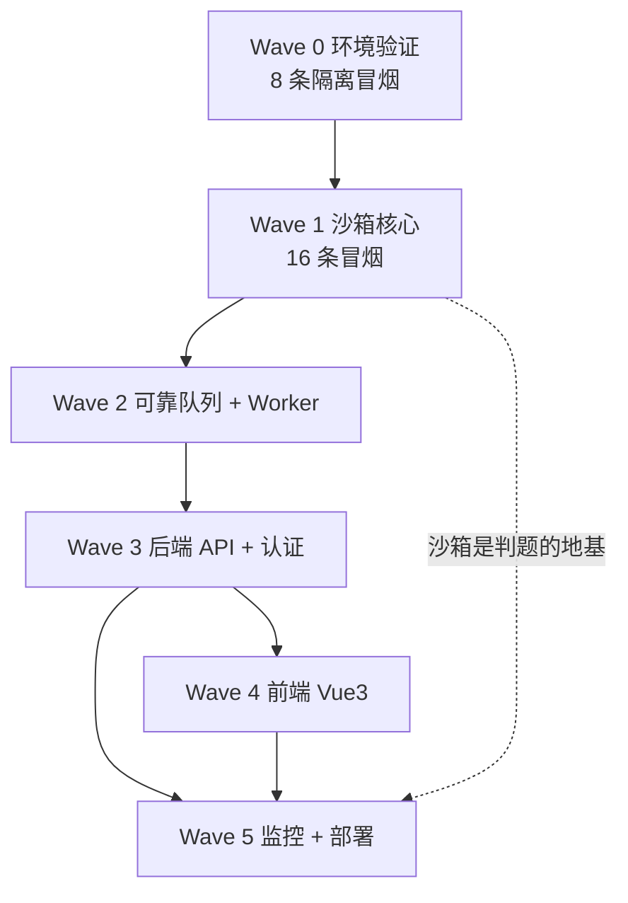
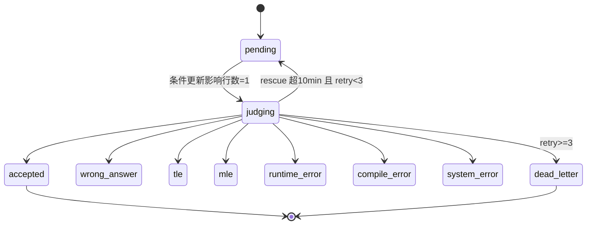

# 全栈在线判题系统 · 开发计划（第三版）

> **本文件定位**：把《全栈在线判题系统：第三版执行计划》从"任务清单"升级为一份**可自测、可沉淀**的学习型开发计划，范式对齐 `D:\ubshare\开发板rk3568\tank_battle\学习笔记.md`。
>
> | tank_battle 学习笔记 | 本文件 |
> |---|---|
> | `## Wave N：主题（技术栈/验证方式）（日期）` | `## Wave N：...（技术栈/验证方式）` |
> | 知识点表（概念 → 代码位置 → 原理 → 课程关联） | 同构，**代码位置为规划路径**（尚不存在，标注 `[规划]`） |
> | 校验题（判断题 + 简答题） | 同构，每波一组 |
> | 易错点区 E1…E57（症状 → 根因 → 修复 → 教训 → 记忆钩子） | 每波末尾先放「易错点种子」，实测后转正为编号条目 |
> | 「架构演进」复盘（双缓冲 → 单世界+锁） | 每波末尾「架构决策与演进」 |
>
> **使用约定**（对齐 tank_battle 笔记并补充）：
> 1. 每个 Wave 一节：`目标 → 前置门禁 → 知识点表 → 任务（含 RED 信号 + 验收）→ 校验题 → 验收标准表 → 易错点`；
> 2. 校验题答案由天枢在对话中判定，**不写在本文件**（防止直接背答案）；判定记录以一行 `**答题判定（日期）**：…` 追加到该波末尾，格式仿 tank_battle Wave 4/5；
> 3. 知识点按「概念 → 代码位置 → 原理 → 关联」四要素记录；
> 4. 每次往代码文件里写内容，必须同步说明该文件写了什么（职责 / 关键函数 / 设计要点）；
> 5. **上一波验收未全绿，不进入下一波**（硬门禁，不许"先写着后面回头补"）；
> 6. 每完成一个可交付版本 → 建一个 git commit（AGENTS.md 约定），信息注明所属 Wave。

---

## 零、总览

### 0.1 阶段表

| 阶段 | 内容 | 时间 | 核心产出 | 门禁 |
|---|---|---|---|---|
| Wave 0 | 环境验证与隔离冒烟测试 | 1 周 | 8 条隔离测试全通过 | 8/8 绿 |
| Wave 1 | 沙箱核心与判题逻辑 | 2 周 | 16 条冒烟测试全通过 | 16/16 绿 |
| Wave 2 | 可靠队列与 Worker | 1.5 周 | Stream + ACK + 条件更新 | 6 条验收全过 |
| Wave 3 | 后端 API 与认证 | 1.5 周 | 认证、限流、排行榜 | 8 条验收全过 |
| Wave 4 | 前端 | 1.5 周 | Vue3 + Monaco Editor | 5 条验收全过 |
| Wave 5 | 监控与部署 | 1.5 周 | Prometheus + Docker | 5 条验收全过 |
| **合计** | | **9 周** | 可演示、可压测、可部署 | |

> 按每天 3~4 小时计。每天 2 小时则约 14 周。

### 0.2 依赖关系（谁阻塞谁）



**读法**：Wave 0 不绿 → Wave 1 无从谈起（沙箱能力未验证）；Wave 1 不绿 → 后面全是空壳（Worker 判不出题）。因此**门禁是串行的**，但 Wave 4（前端）与 Wave 5（监控/部署）在 Wave 3 之后可并行。

### 0.3 提交状态机（贯穿 Wave 2/3 的核心不变量）



> **不变量**：`judging` 不能回 `pending`（除 rescue）；终态不可逆；**每一次从 `pending→judging` 必须由一条"影响行数=1"的条件更新独占获得**——这是幂等与防重复判题的唯一支点。

---

## 零点五、开发环境适配（Windows 宿主 → Linux 目标）★新增

> **为什么单列一节**：原计划的环境基线是 `Ubuntu 22.04 LTS（内核 5.15）`，即**假定宿主就是 Linux**。而当前开发机是 **Windows（win32）**。沙箱的每一项核心能力——`unshare`、cgroup v2 可写、`libseccomp`、`pivot_root`——**在 Windows 原生一律不可用**。不先解决宿主问题，Wave 0 第一天就卡死。

### 可选方案（三选一，推荐 A）

| 方案 | 能跑什么 | 代价 | 结论 |
|---|---|---|---|
| **A. WSL2（Ubuntu 22.04）** | namespace / cgroup v2 / seccomp / pivot_root 基本可达 | 需开 WSL2；内核由微软维护（含 `CONFIG_CGROUPS` 等），`landlock` 视内核版本而定 | **推荐**：最接近原生 Ubuntu，命令行体验一致 |
| B. Docker Desktop（LinuxKit VM） | 容器内可跑，但**容器内再建 cgroup 子树需 systemd `Delegate=yes` 或 `--privileged`** | 嵌套 cgroup 权限麻烦 | 适合 Wave 5 部署联调，不适合 Wave 0 早期验证 |
| C. 远程 Linux 机器 / 云 VM | 完全原生 | 需网络与账号 | 若无本机 WSL2 时的退路 |

### 双平台开发策略（沿用 tank_battle 的"PC 单测 + 目标机终审"）

tank_battle 的教训（E19）：**PC 编译过 ≠ 板上编译过，交叉编译才是终审**。本项目的对应形态是：

| 层 | 在哪写/测 | 说明 |
|---|---|---|
| 纯逻辑（题面解析、输出比对、罚时/评分公式、状态机转移表） | Windows 或 WSL2，**单元测试** | 不碰内核，可脱离沙箱测 |
| 沙箱 / 队列 / API（依赖内核与 Redis/MySQL） | **WSL2 或 Docker**，集成测试 | 必须在 Linux 环境跑 |
| 部署产物 | Docker 镜像（`ubuntu:22.04`） | 目标运行时就是 Linux |

**Wave 0 的冒烟测试全部在 WSL2 内执行**；每条的产物（trace 文件、字符集、syscall 列表）落盘到 `tests/smoke/` 作为证据留档。

### 环境基线（在 WSL2 内确认，而非 Windows）

```
OS: Ubuntu 22.04 LTS（WSL2 内核）
编译器: g++ 11.4（glibc 2.35）
Redis: 7.x
MySQL: 8.x
CMake: 3.22+
库: libseccomp-dev, libcap-dev, libargon2-dev, libhiredis-dev, redis-plus-plus
```

> **自查**：`uname -r` 确认 WSL2 内核版本；`mount | grep cgroup2` 确认 cgroup v2 已挂载；`cat /sys/kernel/security/lsm` 确认 `landlock` 是否在列（不在则任务 0.7 标注为"不可用，降级"）。

### ★ 实际落地结论（复检回填）

**本机最终采用方案 C**（VMware + 现有 Ubuntu VM），而非本节推荐的方案 A（WSL2）。原因：本机 WSL2 未安装且需管理员权限 + 重启；而 VMware Workstation 17.6 已装、且已有一台运行中的 Ubuntu 24.04.3 VM，**零成本可用**。

**实测环境（VM 内，12/12 验收全绿）**：

| 项 | 计划基线 | **实际落地** | 处置 |
|---|---|---|---|
| OS | Ubuntu 22.04（内核 5.15） | **Ubuntu 24.04.3（内核 7.0.0-28-generic）** | 接受；内核更新，cgroup v2 / Landlock 支持更完整 |
| 编译器 | g++ 11.4（glibc 2.35） | **g++ 13.3.0** | 接受；白名单由任务 0.4 用 `strace` 实测生成，**不绑定编译器版本** |
| CMake | 3.22+ | 3.28.3 | 符合 |
| Redis | 7.x | 7.0.15（`XAUTOCLAIM` 可用） | 符合，**任务 2.2 原样可实现** |
| MySQL | 8.x | 8.0.46 | 符合 |
| 库 | libseccomp-dev / libcap-dev / libargon2-dev / libhiredis-dev / redis-plus-plus | 全部齐备（另装 libssl-dev、nlohmann-json3-dev、strace） | 符合 |
| 内核能力 | unshare / cgroup v2 / seccomp / pivot_root | `cgroup2fs` ✅ / `sudo unshare` exit=0 ✅ / `landlock` 在 LSM 列 ✅ | 符合 |

**由此产生的两点计划内调整（不改任务定义）**：

1. **任务 0.4 的白名单产物**：`gpp_syscalls.txt` 将反映 **g++ 13.3.0** 的真实调用序列，而非 11.4——这正是"靠实测不靠记忆"的体现。
2. **Ubuntu 24.04 的非特权 userns 限制**：实测 `sudo unshare` 路径不受影响（root 创建 userns 不被 AppArmor 拦），**任务 0.1 原样可用**；若 Wave 1 改为 rootless 运行，需回看此项。

> **证据出处**：《学习笔记/环境体检.md》第七节、《学习笔记/环境配置.md》第 10 节（12 项验收明细）。

---

## 一、规划目录结构

```
在线答题系统/
├── AGENTS.md
├── 学习笔记/
│   └── 第三版执行计划.md          ← 本文件
├── sandbox/                       # Wave 0/1：沙箱核心（C++）
│   ├── CMakeLists.txt
│   ├── src/
│   │   ├── ns.cpp                 # namespace 隔离（clone flags）
│   │   ├── cgroup.cpp             # cgroup v2 建/迁/读/清
│   │   ├── seccomp.cpp            # 编译期/运行期双白名单
│   │   ├── rootfs.cpp             # tmpfs + bind mount + pivot_root
│   │   ├── runner.cpp             # compile() + run_in_sandbox()
│   │   └── measure.cpp            # cpu.stat / memory.peak / wait4
│   └── tests/smoke/               # Wave 0 的 8 条 + Wave 1 的 16 条
├── worker/                        # Wave 2：队列消费 + 判题状态机
├── server/                        # Wave 3：HTTP API + 认证
├── frontend/                      # Wave 4：Vue3 + Monaco
├── deploy/                        # Wave 5：Dockerfile / compose / systemd
└── tests/smoke/                   # 冒烟脚本与证据（trace、字符集）
```

---

## Wave 0：环境验证与隔离冒烟测试（1 周）

### 目标

在写任何判题逻辑之前，先验证沙箱所需的每一项内核能力在目标平台上可用。**这一步不通过，后面全部白做**——不要抱着"应该能行"往下走。

### 前置门禁

- WSL2（或等价 Linux 环境）可用（见「零点五」）；
- 环境基线中的库已安装：`libseccomp-dev libcap-dev`。

### 知识点表

| # | 知识点 | 代码/命令位置 | 原理一句话 | 关联 |
|---|---|---|---|---|
| 1 | Linux namespace 七类 | `unshare --mount --pid --net` | mount/pid/net/user/uts/ipc/cgroup 各自隔离一类全局资源 | OS：进程与资源隔离 |
| 2 | cgroup v2 统一层级 | `/sys/fs/cgroup/<name>/` | v2 是一棵**单一层级树**，控制文件与计量文件同目录，比 v1 的多控制器挂载简单 | OS：资源控制 |
| 3 | cgroup v2 关键接口 | `memory.max` / `memory.peak` / `pids.max` / `cgroup.procs` / `cpu.stat` | "限制"写 `*.max`，"计量"读 `peak`/`stat`；`cgroup.procs` 是**迁移入口**（写 PID 即迁入） | OS：cgroup |
| 4 | 迁移即"写文件" | `echo $PID > .../cgroup.procs` | 迁进程进 cgroup = 打开 `cgroup.procs` 写入 PID；**先迁后 exec** 才不逃逸 | OS：cgroup |
| 5 | libseccomp 三段式 | `seccomp_init` → `seccomp_rule_add` → `seccomp_load` | 建上下文 → 加规则（默认动作 + 例外）→ 装载生效 | OS：系统调用过滤 |
| 6 | `SCMP_ACT_ERRNO` vs `SCMP_ACT_KILL` | `SCMP_ACT_ERRNO(ENOSYS)` | ERRNO 让应用**看到失败并可捕获**（便于调试）；KILL 直接杀进程（更严但难排查） | OS：seccomp |
| 7 | strace 采集真实序列 | `strace -f -e trace=all -o out.txt g++ ...` | **白名单不能靠记忆，要靠实测**——记录目标程序真实调用序列 | 工具链 |
| 8 | ldd 解析动态依赖 | `ldd prog` | 列出运行期依赖的 `.so`，是 rootfs 挂载清单的唯一依据 | 编译/链接 |
| 9 | pivot_root vs chroot | `syscall(SYS_pivot_root, ".", ".")` | pivot_root **交换根挂载点**（真隔离），chroot 只改路径解析起点（可逃逸） | OS：命名空间 |
| 10 | 挂载传播 MS_PRIVATE | `mount(NULL,"/",NULL,MS_REC\|MS_PRIVATE,NULL)` | 把挂载事件设为**不向宿主传播**，否则沙箱内挂 tmpfs 会污染宿主 | OS：挂载传播 |
| 11 | Redis Stream 消费组 | `XADD` / `XGROUP` / `XREADGROUP` / `XACK` / `XPENDING` | Stream + 消费组 + PEL = **可重投递**的可靠队列（消息被读走未 ACK 即挂在 PEL） | 分布式：可靠队列 |

### 任务（每条附 RED 信号 + 验收）

> **RED 信号** = "如果这项能力在平台上不可用，会看到什么"。先确认能看见失败，再确认能看见成功——只测成功等于没测。

**任务 0.1：验证 namespace 隔离**

```bash
sudo unshare --mount --pid --net --fork --mount-proc /bin/bash
# 内部：
cat /proc/self/mountinfo   # 应看不到宿主挂载
ls /proc                   # 应只有当前 namespace 的进程
```

- RED 信号：报 `unshare: unshare failed: Operation not permitted`（WSL2 未开对应能力 / 无权限）。
- 验收：能看到隔离效果，且**退出后宿主无残留**。

**任务 0.2：验证 cgroup v2 可写**

```bash
mount | grep cgroup2
sudo mkdir /sys/fs/cgroup/judge-test
echo 268435456 | sudo tee /sys/fs/cgroup/judge-test/memory.max
echo 64        | sudo tee /sys/fs/cgroup/judge-test/pids.max
sudo sh -c 'echo $$ > /sys/fs/cgroup/judge-test/cgroup.procs'
cat /sys/fs/cgroup/judge-test/memory.peak
cat /sys/fs/cgroup/judge-test/cpu.stat
```

- RED 信号：`mkdir` 报只读文件系统 / `tee` 报 permission denied（WSL2 中以 root 缺失 cgroup 控制）。
- 验收：能读到 `memory.peak` 与 `cpu.stat` 的 `usage_usec`。

**任务 0.3：验证 seccomp 白名单**

```cpp
// tests/smoke/seccomp_socket.cpp
#include <seccomp.h>
#include <sys/socket.h>
#include <cstdio>
#include <cerrno>

int main() {
    scmp_filter_ctx ctx = seccomp_init(SCMP_ACT_ALLOW);
    seccomp_rule_add(ctx, SCMP_ACT_ERRNO(ENOSYS), SCMP_SYS(socket), 0);
    seccomp_load(ctx);

    int fd = socket(AF_INET, SOCK_STREAM, 0);
    printf("socket returned %d, errno=%d\n", fd, errno);
    // 预期：fd=-1, errno=ENOSYS
    return 0;
}
```

编译 `g++ seccomp_socket.cpp -lseccomp -o seccomp_socket`。
- RED 信号：`socket` 正常返回 fd（规则未生效——通常是忘了 `seccomp_load`）。
- 验收：`socket` 返回 -1，errno 为 ENOSYS。

**任务 0.4：用 strace 记录 g++ 系统调用序列**

```bash
strace -f -e trace=all -o gpp_trace.txt g++ -O2 hello.cpp -o hello
grep -oP '^\d+\s+\K\w+' gpp_trace.txt | sort -u > gpp_syscalls.txt
wc -l gpp_syscalls.txt
```

- 验收：得到 g++ 实际使用的系统调用列表，**确认包含** `clone3`、`statx`、`rseq`、`set_robust_list`、`mprotect`、`madvise`、`arch_prctl`、`getrandom`。
- 此项产物 `gpp_syscalls.txt` 是**Wave 1 编译期白名单的输入**，必须落盘留档。

**任务 0.5：验证 pivot_root + umount 旧根**

```cpp
// 修正顺序：MS_PRIVATE → tmpfs → bind 库 → pivot_root → umount 旧根 → chdir("/")
mount(NULL, "/", NULL, MS_REC | MS_PRIVATE, NULL);
mkdir("/tmp/sb-XXXXXX", 0700);
mount("tmpfs", "/tmp/sb-XXXXXX", "tmpfs", 0, "size=256m,mode=0700,nodev,noexec,nosuid");
// 在 tmpfs 内建目录，bind mount 必要库（见 Wave 1 任务 1.2）
chdir("/tmp/sb-XXXXXX");
syscall(SYS_pivot_root, ".", ".");
umount2(".", MNT_DETACH);   // ★ 关键：卸载旧根，否则旧根仍可达
chdir("/");
system("ls /");
```

- RED 信号：`ls /` 仍能看到宿主根目录树（漏了 `umount2`）。
- 验收：`ls /` 只看到 tmpfs 内目录，看不到宿主根。

**任务 0.6：验证 cgroup 迁移无竞态（管道同步）**

```cpp
int sync_pipe[2]; pipe(sync_pipe);
pid_t child = fork();
if (child == 0) {
    close(sync_pipe[1]);
    char buf; read(sync_pipe[0], &buf, 1);   // 阻塞等父进程放行
    close(sync_pipe[0]);
    execl("/bin/true", "true", nullptr);
} else {
    close(sync_pipe[0]);
    int fd = open("/sys/fs/cgroup/judge-test/cgroup.procs", O_WRONLY);
    dprintf(fd, "%d", child); close(fd);
    write(sync_pipe[1], "x", 1);              // 迁移完成才放行
    close(sync_pipe[1]);
    waitpid(child, nullptr, 0);
}
```

- RED 信号：子进程已 exec 完才迁 cgroup（用 `sleep` 猜测时高概率发生）——PID 不在目标 cgroup 内，或进程已退出导致迁移失败。
- 验收：**子进程执行前已在目标 cgroup 内**（迁完再放行），无 sleep 依赖。

**任务 0.7：验证 Landlock（可选）**

```bash
cat /sys/kernel/security/lsm   # 应包含 landlock
```

- 验收：确认 Landlock 可用；若不可用，**路径管控降级为只读挂载**（本项标注为"降级可用"，不阻塞 Wave 1）。

**任务 0.8：验证 Redis Stream**

```bash
redis-cli XADD judge:stream '*' submission_id 1
redis-cli XGROUP CREATE judge:stream workers '$'
redis-cli XREADGROUP GROUP workers w1 COUNT 1 STREAMS judge:stream '>'
redis-cli XACK judge:stream workers <id>
redis-cli XPENDING judge:stream workers
```

- 验收：完成生产-消费-ACK 全流程，`XPENDING` 显示 **0 条**未确认。

### 校验题（Wave 0 完成后自测）

**判断题**（对/错，并说出理由）：
1. 「沙箱里只要 `chroot` 就能隔离文件系统，不需要 `pivot_root`。」——对还是错？
2. 「`SCMP_ACT_ERRNO(ENOSYS)` 和 `SCMP_ACT_KILL` 效果差不多，选哪个都行。」——对还是错？
3. 「seccomp 白名单可以从文档里抄一份，不必自己跑 strace。」——对还是错？
4. 「`echo $$ > cgroup.procs` 把 shell 迁进 cgroup 后，shell 再 fork 的子进程会自动也在里面。」——对还是错？为什么这对沙箱很关键？
5. 「`mount(NULL,"/",NULL,MS_REC|MS_PRIVATE,NULL)` 是可选的美化步骤，不做也能跑。」——对还是错？

**简答题**：
6. cgroup v2 相比 v1 的"统一层级"是什么意思？对写代码有什么影响？
7. 为什么 `pivot_root` 之后必须 `umount2(".", MNT_DETACH)`？不卸载会怎样？
8. 任务 0.6 用管道同步，如果用 `sleep(1)` 会有什么问题？请描述一个会出错的时序。
9. `ldd` 的输出如何决定 rootfs 的挂载清单？为什么**不**挂 `/usr/bin`、`/usr/include`、`/etc`？
10. Redis 的 `XPENDING` 为 0 说明了什么？如果消费后不 `XACK` 会怎样？

### 验收标准表（8 条全通过才进入 Wave 1）

| 编号 | 测试项 | 通过标准 |
|---|---|---|
| 0.1 | namespace 隔离 | mountinfo 无宿主挂载 |
| 0.2 | cgroup v2 可写 | 读到 `memory.peak` / `cpu.stat` |
| 0.3 | seccomp 白名单 | `socket` 返回 ENOSYS |
| 0.4 | g++ syscall 序列 | 确认 `clone3/statx/rseq` 存在，产物落盘 |
| 0.5 | pivot_root + umount | `ls /` 只见 tmpfs |
| 0.6 | cgroup 迁移同步 | 子进程在目标 cgroup（迁后放行） |
| 0.7 | Landlock 可用 | lsm 列表含 landlock（否则标注降级） |
| 0.8 | Redis Stream | XACK 后 XPENDING 为 0 |

### 易错点种子（Wave 0 · 实测后转正为编号条目）

- **`unshare` 权限与 user namespace**：非 root 下 `--net`/`--mount` 常需 user namespace 配合，WSL2 与原生 Ubuntu 的默认 `unprivileged_userns_clone` 设置可能不同——**先测再写**。
- **pivot_root 前忘 `MS_PRIVATE`**：沙箱内挂载"泄漏"到宿主，表现为宿主 `mountinfo` 出现 `tmpfs`。
- **`seccomp_rule_add` 后忘 `seccomp_load`**：规则不生效，`socket` 照常成功（最隐蔽）。
- **cgroup 迁移用 sleep 猜测**：任务 0.6 的整个存在意义就是消灭它。
- **Redis 忘记建消费组**：`XREADGROUP` 报 `NOGROUP`。

### 架构决策与演进

- **决策**：编译放沙箱外、运行放沙箱内（v1）。理由：编译器依赖大量 syscall 与头文件，在沙箱内编译要么白名单过宽（等于不隔离），要么维护成本高；而**运行用户二进制**才是风险面。代价：需保证"沙箱外编译产物"与"沙箱内运行环境" ABI 一致（见 Wave 1 任务 1.2）。

---

## Wave 1：沙箱核心与判题逻辑（2 周）

### 目标

实现完整判题沙箱，能安全编译并运行用户 C/C++ 代码，产出 **16 条冒烟测试全通过**。

### 前置门禁

- Wave 0 的 8 条全绿；
- `tests/smoke/gpp_syscalls.txt` 已生成（编译期白名单输入）。

### 知识点表

| # | 知识点 | 代码位置 `[规划]` | 原理一句话 | 关联 |
|---|---|---|---|---|
| 1 | clone flags 组合 | `sandbox/src/ns.cpp` | `CLONE_NEWNS\|CLONE_NEWPID\|CLONE_NEWNET\|CLONE_NEWUTS\|CLONE_NEWIPC` 一次性建隔离进程 | OS：进程创建 |
| 2 | 子进程自停 + 父迁移 | `ns.cpp` + `cgroup.cpp` | 子进程 `raise(SIGSTOP)` 自停，父进程趁其未 exec 迁入 cgroup，再 `SIGCONT`——**消除迁移竞态的第二解**（第一解是管道） | OS：信号/同步 |
| 3 | pivot_root 与 mount 标志 | `rootfs.cpp` | `MS_BIND` 是把已有目录"接"到新位置，`MS_RDONLY\|MS_REMOUNT` 二次挂载才能设只读 | OS：挂载 |
| 4 | 进程组管理 | `runner.cpp` `setpgid` + `kill(-pgid, SIGKILL)` | 子进程自建进程组，超时杀**整组**——否则用户 fork 出的孙子进程逃逸成僵尸/占资源 | OS：进程组 |
| 5 | `wait4` 取 rusage | `runner.cpp` | `wait4` 除退出状态外带回 `rusage`（`ru_maxrss`/`ru_utime`），是被杀前的兜底计量 | OS：进程等待 |
| 6 | `memory.events` 的 `oom_kill` | `measure.cpp` | 内存超限的**唯一硬证据**：`oom_kill` 计数 +1 —— 用它区分 MLE 与 TLE | OS：cgroup |
| 7 | RLIMIT_* 语义 | `runner.cpp` | `RLIMIT_CPU`（CPU 秒）、`RLIMIT_FSIZE`（单文件最大字节）、`RLIMIT_NOFILE`（fd 上限）——内核级兜底，与 cgroup 双保险 | OS：资源限制 |
| 8 | seccomp 双阶段白名单 | `seccomp.cpp` | 编译期（宽松，实测生成）与运行期（严格）两套；默认 `SCMP_ACT_ERRNO(ENOSYS)` 起步，跑通再收紧 | OS：seccomp |
| 9 | 输出限制与非阻塞 drain | `runner.cpp` | 管道读端设 `O_NONBLOCK`，定期 drain；父进程**关闭自己的写端**否则读端永不 EOF | OS：管道 |
| 10 | 计量口径 | `measure.cpp` | CPU 时间取 `cpu.stat` 的 `usage_usec`；内存峰值取 `memory.peak`；退出码/信号取 `wait4` | OS：计量 |
| 11 | 幂等清理 | `cgroup.cpp` | 每轮判题结束 rmdir cgroup 与 tmpfs；清理失败不能污染下一轮 | 资源管理 |

### 任务（含 RED 信号 + 验收）

**任务 1.1：沙箱外编译 + 沙箱内运行架构**

```cpp
// 编译阶段（worker 普通环境）
std::string compile(const std::string& code, const std::string& lang) {
    // 写源码到临时文件
    // fork + exec: g++ -O2 -o /tmp/prog /tmp/source.cpp
    // 限制：编译墙钟 30s，RLIMIT_FSIZE 128MB，RLIMIT_NPROC 64
    // 禁止网络（seccomp + net namespace）
}

// 运行阶段（沙箱内）
JudgeResult run_in_sandbox(const std::string& binary,
                           const std::string& input,
                           int time_limit_ms, int memory_limit_mb) {
    // 1. clone 建 namespace 隔离子进程
    // 2. 子进程自停，父进程迁移 cgroup
    // 3. 父进程放行（SIGCONT），子进程 execve 二进制
    // 4. 父进程写 input、读 output
    // 5. 墙钟超时 kill 进程组
    // 6. 读 memory.events 区分 MLE/TLE
    // 7. 读 cpu.stat / memory.peak 计量
    // 8. 清理 cgroup 与 tmpfs
}
```

- RED 信号：编译期白名单过严 → `hello world` 编译失败（对照任务 0.4 的 syscall 列表逐个补）。
- 验收：`hello world` 能编译（对应测试 12）、能运行（对应测试 1/2/3）。

**任务 1.2：根文件系统挂载清单**

```bash
ldd /tmp/prog
# linux-vdso.so.1
# libstdc++.so.6 => /lib/x86_64-linux-gnu/libstdc++.so.6
# libc.so.6      => /lib/x86_64-linux-gnu/libc.so.6
# /lib64/ld-linux-x86-64.so.2
```

挂载清单（全部**只读** bind mount）：`/lib/x86_64-linux-gnu/`、`/lib64/`、`/usr/lib/x86_64-linux-gnu/`。**不挂** `/usr/bin`、`/usr/include`、`/etc`。

- RED 信号：漏挂 `ld-linux-x86-64.so.2` → exec 报 `No such file or directory`（动态链接器找不到，报错信息极具误导性）。
- 验收：沙箱内二进制可正常执行；`ls /` 不含宿主 `/etc`。

**任务 1.3：seccomp 双阶段策略**

```cpp
// 编译期白名单：从 gpp_syscalls.txt 读取，排除危险调用
//   必须包含：clone3, statx, rseq, set_robust_list, mprotect,
//             madvise, arch_prctl, getrandom
//   禁止：socket, connect, bind, listen, accept
// 运行期白名单（严格）：
//   允许：read, write, openat(工作目录内), close, mmap, munmap,
//         brk, exit_group, fstat, lseek, rt_sigaction, rt_sigprocmask
//   禁止：fork, vfork, clone, clone3, execve, socket, connect,
//         ptrace, mount, chroot, setuid, setgid
// 默认动作：SCMP_ACT_ERRNO(ENOSYS)，先跑通再收紧
```

- RED 信号：运行期白名单漏了 `arch_prctl`/`set_robust_list` → 程序启动即 `ENOSYS` 崩溃（这些是 glibc 启动期必调）。
- 验收：测试 11（运行期调 `socket()` → ENOSYS）与测试 12（编译 hello world 成功）同时绿。

**任务 1.4：MLE/TLE 区分**

```cpp
std::string events = read_file(cgroup_path + "/memory.events");
int oom_kill = parse_field(events, "oom_kill");

if (wall_clock_timeout_triggered) {
    result = (oom_kill > 0) ? MLE : TLE;
} else if (WIFSIGNALED(status) && WTERMSIG(status) == SIGKILL) {
    result = (oom_kill > 0) ? MLE : RUNTIME_ERROR;
} else {
    result = check_output(...);
}
```

- RED 信号：不看 `oom_kill` 只凭"超时/被杀"猜 → 内存超限的用例被判成 TLE。
- 验收：测试 6（512MB 分配 / 限 256MB → `oom_kill` +1）与测试 7（状态 MLE）绿。

**任务 1.5：输出限制**

- 输出截断上限 **64MB**，超限判 OLE；
- 管道非阻塞读 + 定期 drain；
- 父进程关闭自己的管道写端；
- 输入在 exec 前写完或异步写。

- RED 信号：父进程没关写端 → 读端等不到 EOF，正常程序也被判 TLE（测试 16 专门盯这个）。
- 验收：测试 15（打印 128MB → OLE，截断 64MB）与测试 16（父进程关写端 → 子进程正常 EOF）绿。

**任务 1.6：计量**

- CPU 时间：`cpu.stat` 的 `usage_usec`
- 内存峰值：`memory.peak`
- 退出码与信号：`wait4()` 的 status

### 校验题（Wave 1 完成后自测）

**判断题**：
1. 「用户程序 fork 出一堆子孙进程，杀主进程就够了，子孙会自己退出。」——对还是错？
2. 「`pivot_root` 之后不需要卸载旧根，因为已经切根了。」——对还是错？
3. 「只要设了 cgroup 的 `pids.max`，就不需要关注用户 fork 炸弹了。」——对还是错？（提示：fork 在哪个阶段被拦？）
4. 「`oom_kill` 计数为 0 就一定不是内存超限。」——对还是错？
5. 「输出限制只要 `read` 完再判断大小即可，不需要非阻塞 drain。」——对还是错？（提示：64MB 写进管道会怎样）

**简答题**：
6. 为什么"编译放沙箱外"能降低安全风险又不牺牲功能？沙箱内编译的替代方案代价是什么？
7. `setpgid` + `kill(-pgid, SIGKILL)` 为什么比只杀 PID 可靠？给出一个逃逸场景。
8. 为什么要给管道读端设 `O_NONBLOCK` 并定期 drain？不这么做，一个无限打印的程序会怎样？
9. 运行期白名单为什么必须包含 `arch_prctl`、`set_robust_list`、`rseq` 这类"看起来没用"的调用？
10. 为什么 seccomp 做不到**路径级**管控（比如"只允许读工作目录"）？那要靠什么补？（提示：Landlock / 只读挂载）

### 验收标准表（16 条全通过才进入 Wave 2）

| 编号 | 测试项 | 验证方法 | 通过标准 |
|---|---|---|---|
| 1 | mount namespace | 沙箱内 `cat /proc/self/mountinfo` | 无宿主挂载 |
| 2 | pivot_root | 沙箱内 `ls /` | 只有 tmpfs 目录 |
| 3 | umount 旧根 | 沙箱内 `ls /tmp/sb-*/` | 旧根不可达 |
| 4 | MS_PRIVATE | 宿主 `mountinfo` | 无 tmpfs 事件 |
| 5 | cgroup 迁移 | 子进程启动后读 `cgroup.procs` | PID 在目标 cgroup |
| 6 | 内存限制 | 分配 512MB，限 256MB | `oom_kill` +1 |
| 7 | MLE 判定 | 上述场景 | 状态 MLE |
| 8 | 墙钟超时 | `while(1) sleep(1);` 限 1 秒 | 1.2 秒内 SIGKILL |
| 9 | TLE 判定 | 上述场景 | 状态 TLE |
| 10 | pids.max | fork 炸弹，限 64 | 第 65 个失败 |
| 11 | 运行期 seccomp | 调用 `socket()` | ENOSYS |
| 12 | 编译期 seccomp | 编译 hello world | 成功 |
| 13 | 文件系统隔离 | 读 `/etc/passwd` | ENOENT |
| 14 | 网络隔离 | connect 1.1.1.1:80 | ENETUNREACH |
| 15 | 输出限制 | 打印 128MB | OLE，截断 64MB |
| 16 | 管道 EOF | 父进程关写端 | 子进程正常 EOF |

### 易错点种子（Wave 1 · 实测后转正）

- **动态链接器漏挂**：exec 报 `No such file or directory` 但文件明明存在——第一反应查 `ldd` 输出的 `/lib64/ld-linux-*`，不是查用户代码。
- **白名单漏启动期调用**：`rseq`/`arch_prctl` 缺失 → 程序一启动就死，容易误判成"用户程序有问题"。
- **父进程不关管道写端**：读端永不 EOF，所有程序都像超时（测试 16 的存在意义）。
- **只杀 PID 不杀进程组**：fork 出的子孙逃逸，判题机被拖垮。
- **OLE 与 TLE 混淆**：输出爆量时若读端阻塞，表现像超时。

### 架构决策与演进

- **决策 1（编译位置）**：v1 沙箱外编译。演进方向 v2：沙箱内编译（白名单用 strace 实测生成，安全边界更紧），但需解决头文件挂载成本。
- **决策 2（迁移竞态解法）**：Wave 0 用管道同步（任务 0.6），Wave 1 正式实现采用"子进程自停 + 父迁移 + SIGCONT"（`CLONE` 后子进程 `raise(SIGSTOP)`）——两解等价，正式实现少一次 `pipe` 创建。**二选一即可，不许 sleep**。

---

## Wave 2：可靠队列与 Worker（1.5 周）

### 目标

基于 Redis Stream 实现可靠任务消费，支持故障恢复、幂等、状态机。

### 前置门禁

- Wave 1 的 16 条全绿；
- Redis 7.x 与 MySQL 8.x 可用（WSL2 内）。

### 知识点表

| # | 知识点 | 代码位置 `[规划]` | 原理一句话 | 关联 |
|---|---|---|---|---|
| 1 | Stream 消费组生命周期 | `worker/src/queue.cpp` | 组内每条消息只投给一个消费者；读走未 ACK 留 PEL，崩溃后可重投 | 分布式：可靠队列 |
| 2 | PEL（Pending Entries List） | `XPENDING` | 记录"已投递未确认"，是故障恢复的唯一线索 | 分布式 |
| 3 | `XCLAIM` vs `XAUTOCLAIM` | `worker/src/rescue.cpp` | `XCLAIM` 按已知 ID 认领；`XAUTOCLAIM` **扫描式**认领（适合不记得 ID 的崩溃恢复） | 分布式 |
| 4 | MySQL 条件更新原子性 | `UPDATE ... WHERE id=? AND status='pending'` | 一条 UPDATE 里"判断+赋值"原子完成；影响行数=0 即"别人抢到了" | 数据库：并发控制 |
| 5 | 状态机转移表 | `worker/src/state_machine.cpp` | 合法转移白名单 + 终态不可逆，防乱序覆盖 | 状态机 |
| 6 | Outbox 模式 | `worker/src/outbox.cpp` | 先把"待投递事件"落库（与业务同一事务），再由投递器发——**本地事务 + 最终一致** | 分布式：一致性 |
| 7 | `FOR UPDATE SKIP LOCKED` | `SELECT * FROM outbox WHERE delivered=0 ... FOR UPDATE SKIP LOCKED` | 多实例抢同一批行时**跳过已被锁的行**，天然分片不阻塞 | 数据库：并发控制 |
| 8 | 死信队列 | `worker/src/rescue.cpp` | 重试耗尽的事件落 `judge:dead_letter`，人工可查，不占主队列 | 可靠性 |
| 9 | 幂等消费 | `worker/src/worker.cpp` | 消息可能重复投递 → 消费侧必须靠"条件更新影响行数"而非"消息唯一" | 分布式 |

### 任务

**任务 2.1：Stream 生产消费**

```cpp
redis.xadd("judge:stream", "*", {"submission_id", std::to_string(sid)});   // 提交接口
auto messages = redis.xreadgroup("workers", consumer_id,
    "judge:stream", ">", 10, 5000ms);                                     // Worker 消费
```

**任务 2.2：XAUTOCLAIM 10 分钟窗口**

```cpp
// 每 30 秒执行
auto claimed = redis.xautoclaim("judge:stream", "workers",
    consumer_id, 600000, "0-0", 10);   // min-idle 10 分钟
```

**任务 2.3：Worker 周期 XCLAIM 重置 idle**

```cpp
// 每 30 秒对自己的 pending 消息执行
for (auto& id : my_pending_ids) {
    redis.xclaim("judge:stream", "workers", consumer_id, id, 0, 30000ms);
}
```

> **为什么需要 2.3**：`XAUTOCLAIM` 的 `min-idle` 用作"判死"阈值，但**长任务**（判题耗时可能 >10 分钟）会误触发认领。周期 `XCLAIM` 把自己正在做的消息 idle 重置为 0，等于"我还活着"。这是 2.2 与 2.3 必须成对出现的原因。

**任务 2.4：MySQL 条件更新幂等**

```sql
UPDATE submission
SET status = 'judging', judge_started_at = NOW()
WHERE id = ? AND status = 'pending';
```

影响行数为 0 → `XACK` 丢弃（已被别人判或已判完）。

**任务 2.5：状态机转移表**

```
pending → judging → accepted / wrong_answer / tle / mle / runtime_error / compile_error / system_error
judging 不能回 pending（除 rescue）
终态不可逆
```

**任务 2.6：rescue 扫描条件更新**

```sql
UPDATE submission
SET status = 'pending', retry_count = retry_count + 1
WHERE id = ? AND status = 'judging'
  AND judge_started_at < NOW() - INTERVAL 10 MINUTE
  AND retry_count < 3;
```

**任务 2.7：死信 Stream**

```cpp
if (retry_count >= 3) {
    redis.xadd("judge:dead_letter", "*", {"submission_id", sid, "error", last_error});
    redis.xack("judge:stream", "workers", msg_id);
}
```

**任务 2.8：Outbox + FOR UPDATE SKIP LOCKED**

```sql
SELECT * FROM outbox WHERE delivered = 0 ORDER BY id LIMIT 100 FOR UPDATE SKIP LOCKED;
```

已投递记录保留 7 天后清理。

### 校验题（Wave 2 完成后自测）

**判断题**：
1. 「消息被消费后不 `XACK` 也没关系，Stream 会自动清理。」——对还是错？
2. 「`XAUTOCLAIM` 的 min-idle 设成 10 分钟，就不用管长任务了。」——对还是错？（提示：任务 2.3）
3. 「用 Redis 分布式锁保护"取任务"比 MySQL 条件更新更可靠。」——对还是错？
4. 「消息可能重复投递，所以消费侧要保证逻辑幂等。」——对还是错？用什么保证？
5. 「`FOR UPDATE` 就够了，不用 `SKIP LOCKED`。」——对还是错？多实例下会怎样？

**简答题**：
6. 一条消息"被读走但 Worker 崩溃"后，恢复路径有哪几步？`XAUTOCLAIM` 在其中扮演什么角色？
7. 为什么"影响行数为 0 → XACK 丢弃"是正确的？如果影响行数为 0 却继续判题会怎样？
8. rescue 扫描的条件为什么要带 `retry_count < 3` 和 `status = 'judging'`？少了哪个会出问题？
9. Outbox 模式解决的具体问题是什么？如果直接"业务写完再发 Redis"会有哪种不一致？
10. `SKIP LOCKED` 相比"等锁"在多实例投递场景下的收益是什么？

### 验收标准

- Worker 处理任务后正确 ACK，PEL 为 0；
- `kill -9` 模拟 Worker 崩溃，10 分钟后消息被其他 Worker 认领；
- 同一任务失败 3 次进死信 Stream；
- 重复消费被 MySQL 条件更新拦截；
- rescue 扫描不覆盖已判完的提交；
- Outbox 多实例并发不重复投递。

### 易错点种子（Wave 2 · 实测后转正）

- **NOGROUP**：消费组未创建就 `XREADGROUP`。
- **min-idle 与长任务打架**：只做 `XAUTOCLAIM` 不做周期 `XCLAIM` → 长判题被抢。
- **rescue 覆盖已判完**：忘了 `status='judging'` 条件。
- **Outbox 未清账**：投递成功但没标 `delivered=1` → 重复投递。

---

## Wave 3：后端 API 与认证（1.5 周）

### 目标

实现完整 HTTP API：认证、限流、参数校验、排行榜。

### 知识点表

| # | 知识点 | 代码位置 `[规划]` | 原理一句话 | 关联 |
|---|---|---|---|---|
| 1 | argon2id 参数选择 | `server/src/auth.cpp` | `(时间成本3, 内存 1<<16 KB, 并行1)` 是**内存困难**函数，抗 GPU 暴力破解 | 安全：口令哈希 |
| 2 | 随机盐 + 编码 | `auth.cpp` `argon2id_hash_encoded` | 同一口令不同盐 → 哈希不同，抗彩虹表 | 安全 |
| 3 | Opaque token | `auth.cpp` `generate_random_token(32)` | 随机串存 Redis，服务端可**随时吊销**（对比 JWT 无状态难吊销） | 安全：会话 |
| 4 | 令牌桶 + Lua 原子性 | `server/src/ratelimit.lua` | `INCR`+`EXPIRE`+比较必须**原子**，否则并发下漏计；Lua 脚本在 Redis 单线程内原子执行 | 分布式：限流 |
| 5 | 参数校验前置 | `server/src/api.cpp` | 校验在**解析后、业务前**：大小/白名单/JSON 合法性三道 | 安全：输入校验 |
| 6 | 唯一约束去重 | `solved` 表 `UNIQUE KEY uk_user_problem` | 去重交给数据库约束，不靠应用层"先查再插"（有 TOCTOU 竞态） | 数据库 |
| 7 | 罚时口径 | `server/src/score.cpp` | `罚时 = 首次AC时刻 - 比赛开始时刻 + 此前错误提交数 × 20 分钟` | 竞赛规则 |
| 8 | score 编码可比性 | `score.cpp` | `solved*1e13 + (1e13 - penalty)`：**题数优先、罚时次之**，单浮点可比较排序 | 编码技巧 |

### 任务

**任务 3.1：密码哈希**

```cpp
std::string hash_password(const std::string& password) {
    char encoded[256];
    argon2id_hash_encoded(3, 1 << 16, 1,
        password.data(), password.size(),
        salt, 16, 32, encoded, sizeof(encoded));
    return std::string(encoded);
}
```

**任务 3.2：Opaque token**

```cpp
std::string token = generate_random_token(32);
redis.setex("session:" + token, 7200, user_id);
```

**任务 3.3：限流 Lua 脚本**

```lua
-- KEYS[1] = rate_limit:user_id
-- ARGV[1] = max_tokens, ARGV[2] = window_seconds
local current = redis.call('INCR', KEYS[1])
if current == 1 then
    redis.call('EXPIRE', KEYS[1], ARGV[2])
end
if current > tonumber(ARGV[1]) then
    return 0
end
return 1
```

**任务 3.4：参数校验**

```cpp
if (body["code"].get<std::string>().size() > 65536)
    return json_error(400, "Code exceeds 64KB");
static const std::set<std::string> allowed = {"cpp", "c"};
if (!allowed.count(body["language"]))
    return json_error(400, "Unsupported language");
try { auto body = json::parse(req.body); }
catch (const json::parse_error&) { return json_error(400, "Invalid JSON"); }
```

**任务 3.5：排行榜 solved 表**

```sql
CREATE TABLE solved (
    user_id INT NOT NULL,
    problem_id INT NOT NULL,
    first_ac_at DATETIME NOT NULL,
    UNIQUE KEY uk_user_problem (user_id, problem_id)
);
```

**只有 `INSERT IGNORE` 影响行数为 1 时才 `ZINCRBY`**。

**任务 3.6：罚时口径**

```
罚时 = 首次 AC 时刻 - 比赛开始时刻 + 此前该题错误提交次数 × 20 分钟
```

**任务 3.7：score 编码**

```cpp
double score = solved * 1e13 + (1e13 - penalty_seconds);
```

### 校验题（Wave 3 完成后自测）

**判断题**：
1. 「密码用 SHA-256 加盐就够了，不必用 argon2id。」——对还是错？
2. 「限流的 `INCR` 和 `EXPIRE` 分开写也没事，Redis 单线程不会崩。」——对还是错？（提示：两条命令之间进程挂了）
3. 「排行榜去重可以先 `SELECT` 查有没有，没有再 `INSERT`。」——对还是错？
4. 「JWT 是无状态的，所以比 opaque token 更适合做可吊销的会话。」——对还是错？
5. 「非法 JSON 应该返回 500，因为服务端处理不了。」——对还是错？

**简答题**：
6. argon2id 为什么抗 GPU 暴力破解？三个参数分别控制什么？
7. 同一题重复 AC，为什么不重复计分？唯一约束在其中起什么作用？如果只靠应用层判断，什么情况下会漏？
8. score 编码 `solved*1e13 + (1e13-penalty)` 的每一项分别代表什么？为什么罚时要用 `1e13 - penalty`？
9. 参数校验为什么必须在"业务逻辑之前、JSON 解析之后"？把 64KB 校验放到判题 Worker 里有什么问题？
10. 令牌桶的 `EXPIRE` 只在 `current == 1` 时设置——为什么这样写？

### 验收标准

- 注册、登录、提交、查询完整流程可运行；
- 密码 argon2id 存储；
- Token 过期返回 401；
- 同一用户 1 秒第 4 次提交返回 429；
- `code` 超 64KB 返回 400；
- `language` 不在白名单返回 400；
- 非法 JSON 返回 400 而非 500；
- 同一题重复 AC 不重复计分。

### 易错点种子（Wave 3 · 实测后转正）

- **TOCTOU**：先查后插的去重方式在并发下漏计分。
- **JSON 异常未捕获**：非法输入 500 而非 400（暴露栈信息）。
- **Lua 里 `tonumber` 缺失**：`ARGV` 是字符串，直接比较会按字典序出错。

---

## Wave 4：前端（1.5 周）

### 目标

Vue3 + TypeScript 前端：题目浏览、代码编辑、提交、结果展示。

### 知识点表

| # | 知识点 | 代码位置 `[规划]` | 原理一句话 | 关联 |
|---|---|---|---|---|
| 1 | Composition API | `frontend/src/views/*.vue` | `setup()` + `ref/reactive` 把状态与逻辑聚合，比 Options API 更利于抽组合函数 | 前端框架 |
| 2 | Monaco 集成 | `frontend/src/components/CodeEditor.vue` | 用 `@guolao/vue-monaco-editor` 包一层，`v-model` 绑代码文本 | 前端 |
| 3 | Axios 封装 | `frontend/src/api/http.ts` | 统一注入 token、统一错误处理（401 跳登录） | 前端 |
| 4 | 短轮询 | `frontend/src/views/Submit.vue` | 判题是异步的，2 秒间隔轮询状态；终态即 `clearInterval` | 前后端协作 |
| 5 | 轮询生命周期 | `Submit.vue` `onUnmounted` | 切换路由必须清定时器，否则内存泄漏 + 幽灵请求 | 前端：生命周期 |

### 任务

**任务 4.1：项目搭建**

```bash
npm create vite@latest oj-frontend -- --template vue-ts
cd oj-frontend
npm install axios monaco-editor @guolao/vue-monaco-editor
```

**任务 4.2**：题目列表页 → 调 `/api/problems`，表格展示。
**任务 4.3**：题目详情页 → Markdown 渲染 + Monaco + 提交按钮。
**任务 4.4：提交与轮询**

```typescript
const submit = async () => {
    const { data } = await axios.post('/api/submit', { problem_id, code, language });
    const sid = data.submission_id;
    const timer = setInterval(async () => {
        const { data: status } = await axios.get(`/api/submission/${sid}/status`);
        if (['accepted', 'wrong_answer', 'tle', 'mle'].includes(status.result)) {
            clearInterval(timer);
        }
    }, 2000);
};
```

**任务 4.5**：排行榜页 → 调 `/api/leaderboard`，Top 20。

### 校验题（Wave 4 完成后自测）

**判断题**：
1. 「轮询注册了 `setInterval` 就不用管了，浏览器会自动回收。」——对还是错？
2. 「前端可以直接存 token 到 localStorage，反正只是学习项目。」——对还是错？有什么风险？
3. 「轮询间隔越短体验越好，设成 100ms。」——对还是错？
4. 「提交后前端应该等判题结果返回再显示提交成功。」——对还是错？

**简答题**：
5. 为什么判题用"提交即返回 + 轮询状态"而不是"同步等待判题完成"？
6. 轮询在哪些情形下必须 `clearInterval`？漏了会怎样？
7. 前端 401 拦截统一跳登录，相比每个页面各写一遍好在哪？

### 验收标准

- 题目列表、详情可浏览；
- Monaco Editor 正常编写 C++；
- 提交后轮询显示进度；
- 完成后显示最终结果；
- 排行榜实时更新。

### 易错点种子（Wave 4 · 实测后转正）

- **定时器泄漏**：路由切换未清 `setInterval`。
- **轮询风暴**：间隔过短 + 多标签页 → 后端压力。
- **终态漏判**：`compile_error`/`runtime_error` 不在终态集合里 → 永久轮询。

### ★ 前端运行与查看方式（补原点计划缺口）

> **缺口**：原「双平台开发策略」只覆盖了纯逻辑 / 沙箱队列 API / 部署产物三类，**未写明前端跑在哪、怎么看到**。本节补齐。

**前端是什么**：一个由 Vite 提供的开发服务器，默认监听 **5173** 端口，把网页喂给浏览器。"看前端" = 用浏览器打开它的地址。

**★ 已定案：后端在 VM，前端在 Windows**

| 组件 | 位置 | 地址 |
|---|---|---|
| 后端 API | VM（Ubuntu 24.04.3） | `http://192.168.40.128:8080` |
| 前端 dev server | Windows | `http://localhost:5173` |
| 浏览器 | Windows | 打开 `http://localhost:5173` |

代价与前提：VM **不需要**装 node（node 只在 Windows 侧用）；但前端要跨机访问后端，**必须解决跨域**——见下节。

### ★ 跨域怎么处理（两条路，走代理）

前端在 `localhost:5173`、后端在 `192.168.40.128:8080`——**端口不同即不同源**，浏览器默认拦。

**路线一：Vite 开发代理（本项目采用）**

让前端 dev server 把 `/api` 开头的请求转发给后端。浏览器只跟 `localhost:5173` 说话，**同源，不触发跨域**。

`vite.config.ts`：

```ts
import { defineConfig } from 'vite'
import vue from '@vitejs/plugin-vue'

export default defineConfig({
  plugins: [vue()],
  server: {
    port: 5173,
    proxy: {
      '/api': {
        target: 'http://192.168.40.128:8080',
        changeOrigin: true,
        // 不做 rewrite：后端路由本身就带 /api 前缀
      },
    },
  },
})
```

好处：
- 后端**一行 CORS 代码都不用写**
- 无预检（OPTIONS）往返，无需维护 `Access-Control-Allow-Origin`
- 任务 4.4 写的 `axios.post('/api/submit', ...)` **原样可用**（相对路径）
- token / Cookie 同源，不踩 `SameSite` 的坑

**路线二：后端开 CORS（真·跨域，本项目不用）**

后端需在每个响应里加：

```
Access-Control-Allow-Origin: http://localhost:5173
Access-Control-Allow-Credentials: true
```

并**额外处理 `OPTIONS` 预检**（浏览器对带自定义头 / JSON 的请求会先发 OPTIONS）。用 cpp-httplib 要自己写这层——多一份代码、多一类 bug。

> **结论**：开发期走**路线一**。路线二只在前端部署到别的域名、后端无法代理时才需要；本项目 Wave 5 是 nginx 同机托管，也用不上。

**三个必知细节**：

1. **Vite 默认只监听 `127.0.0.1`** —— 本方案前端在 Windows、浏览器也在 Windows，`npm run dev` 直接可用，**不需要 `--host`**。只有将来想让局域网内别的设备访问时，才加 `--host`。
2. **热更新（HMR）**：改 `.vue` 保存，浏览器自动刷新——这是开发时的主循环。
3. **"看前端"的三个窗口**：页面本身 + F12 的 **Console**（看报错）+ **Network**（看 API 调用）。

**最终形态**：Wave 5 用 Docker/nginx 托管后，访问 `http://192.168.40.128:8080`，像普通网站一样。

**链路已实测通过**：

```bash
# VM 内临时起静态服务
cd /tmp && python3 -m http.server 8000
# Windows 浏览器打开 http://192.168.40.128:8000 → 看到目录列表
```

**结论**：宿主 → VM 的 **TCP 端口链路已打通**（不只是 ICMP ping）。旁证：宿主访问 VM 的 22 端口返回 `Connection refused`（RST），说明 TCP 路径可达、仅无监听服务。因此 Vite 代理指向 `192.168.40.128:8080` **具备物理基础**，Wave 4 不会卡在网络层。

---

## Wave 5：监控与部署（1.5 周）

### 目标

Prometheus 指标、Docker 部署、压测报告。

### 知识点表

| # | 知识点 | 代码位置 `[规划]` | 原理一句话 | 关联 |
|---|---|---|---|---|
| 1 | 四类指标 | `deploy/metrics.cpp` | Counter（只增，如提交总数）/ Gauge（可增可减，如队列长度）/ Histogram（分布，如判题耗时） | 可观测性 |
| 2 | 队列指标 | `judge_stream_length` / `judge_pending_count` | 前者 `XLEN`，后者 `XPENDING`——**积压监控的两条腿** | 可观测性 |
| 3 | spdlog JSON sink | `deploy/logging.cpp` | spdlog 不原生输出 JSON，需自定义 sink 或换 `boost::log` | 日志 |
| 4 | Redis 持久化 | `deploy/redis.conf` | `appendonly yes` + `appendfsync everysec` 兼顾持久性与性能 | 持久化 |
| 5 | `maxmemory-policy noeviction` | `redis.conf` | 内存满时**拒绝写**而非逐出 key——判题队列被逐出 = 任务丢失 | 可靠性 |
| 6 | Docker 多阶段构建 | `deploy/Dockerfile` | builder 阶段装编译依赖，运行时阶段只拷产物（镜像小、攻击面小） | 部署 |
| 7 | cgroup delegation | `deploy/judge-worker.service` | systemd `Delegate=yes` 把 cgroup 子树控制权交给服务，**免 `--privileged`** | 部署：最小权限 |
| 8 | 压测口径 | `deploy/submit.lua` | 记录 QPS / P95 延迟 / 积压峰值 / Redis 内存 | 性能 |

### 任务

**任务 5.1：Prometheus 指标**

| 指标 | 类型 | 说明 |
|---|---|---|
| `judge_stream_length` | Gauge | `XLEN judge:stream` |
| `judge_pending_count` | Gauge | `XPENDING judge:stream workers` |
| `judge_task_duration_seconds` | Histogram | 判题耗时 |
| `submit_total` | Counter | 提交总数 |
| `judge_result_total` | Counter | 按结果分类 |
| `worker_heartbeat` | Gauge | Worker 心跳 |

**任务 5.2：spdlog JSON sink** —— spdlog 不原生输出 JSON，需自定义 sink 或换 `boost::log`。

**任务 5.3：Redis 持久化配置**

```
appendonly yes
appendfsync everysec
maxmemory-policy noeviction
```

**任务 5.4：Docker 多阶段构建**

```dockerfile
FROM ubuntu:22.04 AS builder
RUN apt install -y g++ cmake libseccomp-dev libargon2-dev libhiredis-dev
COPY . /src
RUN cmake -B build /src && cmake --build build

FROM ubuntu:22.04
RUN apt install -y libseccomp2 libargon2-1 libhiredis1
COPY --from=builder /src/build/judge-worker /usr/bin/
CMD ["judge-worker"]
```

**任务 5.5：cgroup delegation**

```ini
[Service]
Delegate=yes
```

Worker 容器**不用** `--privileged`，通过 systemd `Delegate=yes` 获得 cgroup 子树控制权。

**任务 5.6：压测**

```bash
wrk -t4 -c100 -d30s -s submit.lua http://localhost:8080/api/submit
```

记录：提交 QPS、判题 P95 延迟、队列积压峰值、Redis 内存占用。

### 校验题（Wave 5 完成后自测）

**判断题**：
1. 「Worker 容器必须 `--privileged` 才能操作 cgroup。」——对还是错？
2. 「Redis 用 `allkeys-lru` 更省内存，队列被逐出也没关系。」——对还是错？
3. 「`appendfsync always` 最安全，应该无脑选它。」——对还是错？
4. 「多阶段构建只是让 Dockerfile 好看，对镜像大小没影响。」——对还是错？

**简答题**：
5. `judge_stream_length` 和 `judge_pending_count` 分别反映队列的什么状态？只监控一个会漏掉什么故障？
6. `noeviction` 相比 `allkeys-lru` 在判题系统里的取舍是什么？
7. `Delegate=yes` 为什么能替代 `--privileged`？它授予的权限边界是什么？
8. 压测报告要记哪四个数？为什么 P95 比平均延迟更能说明问题？

### 验收标准

- Prometheus 采集到全部指标；
- `docker-compose up -d` 一键启动；
- Worker 容器无 `--privileged`；
- 压测报告包含 QPS、P95、积压峰值；
- Redis 配置包含 AOF + `noeviction`。

### 易错点种子（Wave 5 · 实测后转正）

- **容器内 cgroup 只读**：缺 `Delegate` 或挂载参数，`mkdir` 失败。
- **多阶段构建漏拷贝运行库**：运行时镜像缺 `libseccomp2`，启动即挂。
- **Redis AOF 未开**：重启后 Stream 丢失。
- **压测把限流打满**：`wrk` 同 IP 触发 429，QPS 数据失真（需绕过限流或用多 token）。

---

## 二、易错点总区（持续补充，编号 E1… 与 tank_battle 对齐）

> 规则对齐 tank_battle：每条含「症状 → 根因 → 修复 → 教训 → 记忆钩子」。实测踩到后填入并编号。以下为**由风险表预置的种子**（尚未实测，故暂不编号）。

| 主题 | 种子条目 | 记忆钩子 |
|---|---|---|
| seccomp | 白名单漏 syscall 导致编译/运行失败 | 白名单靠 strace 实测，不靠记忆 |
| cgroup | 权限不足（非 root / 容器内只读） | Delegate=yes + 非 root |
| 队列 | XAUTOCLAIM 窗口与长任务不匹配 | 10min 窗口 + 周期 XCLAIM「我还活着」 |
| 排行榜 | 并发重判重复计分 | solved 唯一约束 + INSERT IGNORE 影响行数 |
| Redis | 内存不足逐出 Stream | noeviction + 监控积压 |
| 前端 | 轮询压力 / 定时器泄漏 | 2 秒间隔 + onUnmounted 清理 |
| 管道 | 父进程不关写端 → 假超时 | 读端要 EOF，先关自己的写端 |
| 进程 | 只杀 PID 不杀进程组 | kill(-pgid, SIGKILL) |
| 计量 | 不看 oom_kill 就判 TLE | memory.events 是唯一硬证据 |

---

## 三、关键风险与对策

| 风险 | 对策 |
|---|---|
| seccomp 白名单漏系统调用导致编译失败 | 用 strace 实测生成（任务 0.4），默认 ENOSYS 起步 |
| cgroup 权限不足 | systemd `Delegate=yes` + 非 root 用户 |
| XAUTOCLAIM 窗口与任务时长不匹配 | 10 分钟窗口 + 周期 XCLAIM |
| 排行榜并发重判重复计分 | solved 表唯一约束 + INSERT IGNORE |
| Redis 内存不足逐出 Stream | noeviction + 监控内存 |
| 前端轮询压力 | 2 秒间隔，判题结果数秒内返回 |
| **Windows 宿主无法跑沙箱** ★ | WSL2 / Docker / 远程 VM（见「零点五」） |

---

## 四、面试/答辩可深入的技术点

**沙箱**
- 为什么沙箱外编译？
- `pivot_root` 与 `chroot` 的区别？
- `MS_PRIVATE` 解决什么？
- cgroup 迁移竞态的两种解法（管道 / 子进程自停）？
- seccomp 为什么做不到路径管控？

**队列**
- `XAUTOCLAIM` 的 min-idle 如何与 P99 对齐？
- MySQL 条件更新为什么比 Redis 锁可靠？
- 状态机转移表如何防止 rescue 覆盖？

**正确性**
- MLE/TLE 如何用 cgroup 证据区分？
- 排行榜去重为什么必须靠数据库唯一约束？

**一致性**
- Outbox 的 `FOR UPDATE SKIP LOCKED` 解决什么？
- `noeviction` 与 `allkeys-lru` 的区别？

---

## 五、下一步

1. **先做「零点五」**：在 WSL2 / Docker / 远程 VM 中确定开发环境，确认 `unshare`、cgroup v2、seccomp、Redis 全部可用——这一步不通，Wave 0 无意义。
2. **执行 Wave 0 的 8 条隔离冒烟测试**。每条写成独立的 C++ 或 shell 脚本，放 `tests/smoke/`；产物（`gpp_trace.txt`、`gpp_syscalls.txt`、字符集）落盘留档。
3. 8 条全绿后再进 Wave 1。

> **本计划的自我要求**（照搬 tank_battle 结语精神）：**写不出来的冒烟测试项，就是方案还没想清楚的部分。** 遇到这类项，先停下来把设计想透，不要用"先写着看"糊过去。
