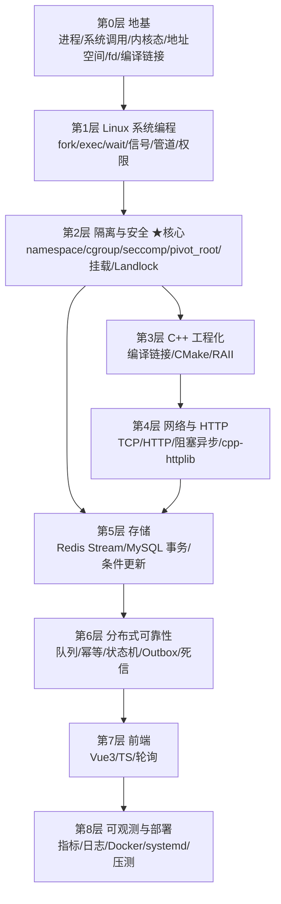

# 零基础知识地图（配合《第三版执行计划》）

> **目的**：把本项目涉及的每一项技术，从零讲清「它是什么 / 为什么需要 / 对应项目哪里」。计划里的「知识点表」是速查索引，本文件是它的**前置讲义**——看不懂计划里的术语时回到这里。
>
> **假设起点**：会写基本代码（任一语言），但没系统学过 Linux 系统编程 / 分布式系统 / 前端框架。若某层你已会，直接跳到下一层。
>
> **用法**：**按层顺序学**（下层是上层的地基，跳层会卡）。每学完一层，去《第三版执行计划》对应 Wave 做校验题自测（答案不入文档，找天枢判定）。

---

## 学习路线总览

| 层 | 主题 | 对应计划 |
|---|---|---|
| L0 | 计算机地基 | 全篇前置 |
| L1 | Linux 系统编程 | Wave 0 / Wave 1 |
| L2 | 隔离与安全 ★ | Wave 0 / Wave 1 |
| L3 | C++ 工程化 | Wave 1 / Wave 3 |
| L4 | 网络与 HTTP | Wave 3 |
| L5 | 存储 | Wave 2 / Wave 3 |
| L6 | 分布式可靠性 | Wave 2 |
| L7 | 前端 | Wave 4 |
| L8 | 可观测与部署 | Wave 5 |

---

## 第 0 层：地基（不学这层，后面全是天书）

### 0.1 程序 / 进程 / 线程
- **一句话**：程序是躺在磁盘上的可执行文件；进程是它被加载进内存、跑起来的实例；线程是进程内可以并行执行的更小单位。
- **为什么需要**：判题系统每判一份代码就要"跑起来一个东西"——那个东西就是进程。超时杀谁、限制谁的内存，都要落到进程上。
- **零基础类比**：程序 = 菜谱（静止），进程 = 正在照着菜谱做菜（动起来），线程 = 厨房里多个人同时做不同步骤。

### 0.2 系统调用（syscall）
- **一句话**：你的程序想读文件、开网络、要内存，都不能自己动手，只能"请求内核代办"——这个请求接口就是系统调用。
- **为什么需要**：本项目的沙箱核心就是**限制用户代码能发哪些系统调用**（seccomp 白名单）；计划任务 0.4 用 `strace` 记录的就是系统调用序列。
- **零基础类比**：你是租客，水电煤开关都在房东（内核）手里，你只能用"打电话"（系统调用）让房东操作。

### 0.3 用户态与内核态
- **一句话**：CPU 有两种运行级别——用户态（程序跑的地方，权限受限）和内核态（操作系统跑的地方，权限无限）。
- **为什么需要**：理解"为什么程序不能随便改别人的内存/关别的进程"——因为它跑在用户态。沙箱的一切限制，本质都是"把用户代码死死摁在用户态"。
- **零基础类比**：用户态 = 银行柜台外面的客户，内核态 = 柜台里面的柜员。

### 0.4 虚拟地址空间
- **一句话**：每个进程都以为自己独占一整块内存（从 0 开始编址），实际是内核用一张映射表骗它的；不同进程的同一个地址指向不同的物理内存。
- **为什么需要**：内存限制（cgroup `memory.max`）、`mmap`、动态库加载，全都跑在这套机制上。
- **零基础类比**：每个房间挂的门牌都从 1 号开始，但每栋楼的"1 号房"实际位置不同。

### 0.5 文件描述符（fd）
- **一句话**：一个整数，代表"一个打开的文件/网络连接/管道"。0=stdin、1=stdout、2=stderr 是约定的三个。
- **为什么需要**：计划任务 1.5 要处理"管道读写"、`O_NONBLOCK`——那些操作的对象就是 fd。
- **零基础类比**：fd 像图书馆的借书证号，拿着号才能取书（操作文件）。

### 0.6 编译 / 链接 / 动态库
- **一句话**：源码 →（编译）→ 目标文件 →（链接）→ 可执行文件；动态库（`.so`）是运行时才去找的共享代码。
- **为什么需要**：沙箱里跑用户程序时，必须把 `libc.so`、动态链接器 `ld-linux` 挂进去，否则程序启动就报"找不到文件"（计划任务 1.2 的核心坑）。
- **零基础类比**：编译 = 把你的菜谱翻译成厨房能读的格式；动态库 = 公共调料架，做菜时才去拿。

---

## 第 1 层：Linux 系统编程

### 1.1 fork / exec / wait
- **一句话**：`fork` 复制出一个子进程；`exec` 把当前进程"变身"成另一个程序；`wait` 父进程等子进程结束并拿它的退出状态。
- **为什么需要**：判题流程就是"fork 出子进程 → 迁进 cgroup → exec 用户程序 → wait 取结果"。计划任务 0.6 的迁移同步、任务 1.6 的计量都建在这上面。
- **零基础类比**：fork = 克隆一个自己；exec = 克隆体整容成另一个人；wait = 等它下班汇报。

### 1.2 进程组与信号
- **一句话**：进程可以组成"组"；信号是内核发给进程的通知（如 `SIGKILL` 强制杀死、`SIGSTOP` 暂停）。
- **为什么需要**：用户程序可能 fork 出一堆子孙进程。**只杀主进程会漏掉子孙**，必须 `kill(-pgid, SIGKILL)` 杀整组（计划任务 1.1 的 RED 信号）。
- **零基础类比**：信号 = 老板给员工发指令条；杀整组 = 连外包团队一起清场。

### 1.3 管道与重定向
- **一句话**：管道（pipe）是一根内存里的管子，一端写、一端读，用来把数据从一个进程传给另一个。
- **为什么需要**：判题时把测试输入喂给用户程序、把它的输出读回来，用的就是管道。读端不设 `O_NONBLOCK` 会被无限输出的程序卡死（计划任务 1.5）。
- **零基础类比**：管道 = 传菜窗口。

### 1.4 权限模型（uid / gid / capability）
- **一句话**：Linux 传统上用"用户 ID / 组 ID"判断你能不能干某事；`capability` 是把 root 的超能力拆成几十个细粒度权限（如"能建命名空间"）。
- **为什么需要**：沙箱要"最小权限"——不给 root，只给刚好够的那几个 capability。项目依赖 `libcap-dev` 就是为了这个。
- **零基础类比**：root = 万能钥匙；capability = 把万能钥匙拆成"只能开大门""只能开电箱"等单功能钥匙。

---

## 第 2 层：隔离与安全 ★本项目核心

> 这一层是 OJ 沙箱的心脏。**沙箱的目标**：让不可信的用户代码跑起来，但它看不到、动不了、也拖不垮外面。

### 2.1 namespace（命名空间）
- **一句话**：给进程一个"独立的视野"——独立的进程列表、独立的网络、独立的挂载表等。一共有 7 类：mount / pid / net / user / uts / ipc / cgroup。
- **为什么需要**：让沙箱里的进程看不到宿主进程、连不上网。计划任务 0.1 就是验证这个。
- **零基础类比**：给员工一间隔音单间，他在里面看不到也听不到外面。

### 2.2 cgroup v2（控制组）
- **一句话**：把进程"分到一组"，对这组统一限量（CPU、内存、进程数）和计量。v2 是**一棵单一的树**（v1 是多棵，乱）。
- **为什么需要**：判题要限制"这份代码最多用 256MB 内存 / 1 秒 CPU"。超了要被杀并判 MLE/TLE。关键文件：`memory.max`（限制）、`memory.peak`（峰值）、`memory.events`（含 `oom_kill` 计数）、`cpu.stat`。
- **零基础类比**：给每个员工发一张限额饭卡，吃超了自动断供，且饭卡上记着吃了多少。

### 2.3 seccomp（安全计算模式）
- **一句话**：一个内核机制，能规定"这个进程只准调用这些系统调用，其它一律拒绝"。
- **为什么需要**：用户代码不该能 `socket`（联网）、`fork`（炸进程）、`mount`。用 seccomp 把它们拦掉。计划任务 0.3 / 1.3 就是它。
- **零基础类比**：给员工的手机只开通"打给前台"一个号码，其它号码全打不通。
- **关键细节**：默认动作选 `SCMP_ACT_ERRNO(ENOSYS)`（让程序看到失败、可调试）而不是 `SCMP_ACT_KILL`（直接杀，难排查）。

### 2.4 pivot_root（切换根目录）
- **一句话**：把进程眼中的"/"根目录，从宿主的根**换**成沙箱自己的小目录树。它比老式的 `chroot` 更彻底——`chroot` 只是改了路径起点，还可能被逃逸。
- **为什么需要**：让用户在沙箱里 `ls /` 只看到我们准备好的空目录，看不到宿主的 `/etc/passwd`。计划任务 0.5。
- **零基础类比**：chroot = 蒙上眼睛只说"你现在在一楼"；pivot_root = 真把你搬进一间独立小屋。
- **关键细节**：pivot_root 之后**必须** `umount2(".", MNT_DETACH)` 卸载旧根，否则老根还挂在那、能摸回去。

### 2.5 挂载传播（MS_PRIVATE）
- **一句话**：控制"在沙箱里挂载一个目录，这个动作会不会传染到宿主"。
- **为什么需要**：默认"会传染"，沙箱里挂 tmpfs 可能污染宿主。设 `MS_PRIVATE` 让挂载事件到此为止。
- **零基础类比**：在隔音间里开喇叭，默认会串音到隔壁；MS_PRIVATE = 装隔音棉。

### 2.6 Landlock（可选，路径级管控）
- **一句话**：Linux 5.13+ 的机制，能让进程只能访问指定的文件路径。
- **为什么需要**：seccomp 只能管"能不能读文件"，管不了"能读哪个文件"；Landlock 补这个空缺。不可用时降级为"只读挂载"（计划任务 0.7 标注降级，不阻塞）。

---

## 第 3 层：C++ 工程化

### 3.1 编译链接与 ABI
- **一句话**：ABI 是"二进制层面的约定"——函数怎么传参、结构体怎么排布、库怎么命名。两边 ABI 不一致，链接/运行就会崩。
- **为什么需要**：计划强调"沙箱外编译、沙箱内运行"——必须保证两边的 C 库版本/ABI 一致，否则运行时报奇怪的错。

### 3.2 CMake
- **一句话**：C++ 的构建系统生成器——用 `CMakeLists.txt` 描述"源码在哪、依赖什么库、生成什么"，再生成 make/ninja 去实际构建。
- **为什么需要**：整个 `sandbox/`、`worker/`、`server/` 都用它组织。环境里已确认 cmake 4.3.3（宿主）/ 预计 3.28（VM）。
- **零基础类比**：CMake = 工程蓝图，ninja/make = 按图施工的工人。

### 3.3 RAII
- **一句话**：C++ 的"资源获取即初始化"——用对象生命周期管理资源，离开作用域自动释放（如 `std::unique_ptr` 自动释放内存、`std::lock_guard` 自动解锁）。
- **为什么需要**：沙箱里有大量 fd、cgroup、挂载点要清理，忘了就泄漏、污染下一轮（计划任务 1.11「幂等清理」）。

---

## 第 4 层：网络与 HTTP

### 4.1 TCP 与 socket
- **一句话**：socket 是"网络通信的 fd"；TCP 保证数据可靠、按顺序到达。`bind` 绑定端口、`listen` 开始监听、`accept` 接客、`connect` 主动连。
- **为什么需要**：后端 API 服务器要监听端口等前端来连。也是 seccomp 要拦的东西（任务 1.3 禁止 `socket/connect/bind/listen/accept`）。

### 4.2 HTTP 协议
- **一句话**：请求 = 方法（GET/POST）+ 路径 + 头 + 体；响应 = 状态码（200/400/401/429/500）+ 头 + 体。
- **为什么需要**：计划 Wave 3 的验收标准全是状态码——401 未登录、429 限流、400 参数非法。**非法 JSON 要返回 400 而不是 500**（这是常错点）。

### 4.3 阻塞 vs 异步
- **一句话**：阻塞 = 一个请求处理完才接下一个；异步 = 用事件循环同时管很多连接。
- **为什么需要**：OJ 的提交接口是"提交即返回、前端轮询结果"，单请求极快，**阻塞模型足够**。这也是选 cpp-httplib 的理由。

### 4.4 cpp-httplib（已定选型）
- **一句话**：一个单头文件的 C++ HTTP 库，`#include` 即用，handler 里直接拿 `req.body`、设 `res.status`。
- **为什么需要**：学习重点是沙箱和分布式，不该被 HTTP 解析拖住。它的 API 正好贴合计划任务 3.4 的伪代码。

---

## 第 5 层：存储

### 5.1 Redis 基础
- **一句话**：内存键值数据库，单线程执行命令（所以每条命令天然原子）。
- **为什么需要**：做任务队列、会话（token）、限流计数。
- **关键差异**：宿主那个是 Windows 版 5.0.14，**缺 `XAUTOCLAIM`**；VM 内务必装 7.x。

### 5.2 Redis Stream / 消费组 / PEL ★
- **一句话**：Stream 是"带消费者组的消息队列"；消费组让一条消息只投给一个消费者；**PEL（Pending Entries List）** 记录"已投递但还没 ACK 的消息"——这是崩溃恢复的唯一线索。
- **为什么需要**：本项目用它做判题任务队列。`XADD` 生产、`XREADGROUP` 消费、`XACK` 确认、`XAUTOCLAIM` 认领"超时没 ACK"的消息。
- **零基础类比**：PEL = 快递公司的"已派送未签收"清单；快递员（worker）半路出事，这条就能改派给别人。

### 5.3 MySQL 事务与隔离级别
- **一句话**：事务 = 一组要么全成要么全不成的操作；隔离级别决定并发事务之间能"看到"多少对方的中间状态。
- **为什么需要**：判题状态更新（pending→judging）必须原子，不能两个 worker 同时把同一份提交改成 judging。

### 5.4 条件更新与行锁 ★
- **一句话**：`UPDATE ... WHERE id=? AND status='pending'` 把"判断 + 修改"合并成一条原子操作；返回"影响行数"。行数=1 说明是你抢到的，=0 说明别人先改了。
- **为什么需要**：这是**幂等和防重复判题的唯一支点**（计划核心不变量）。消息可能重复投递，消费侧靠这个挡住。
- **零基础类比**：抢座位——"如果这个位子还空着，我就坐下"，返回"我坐下成功了吗"。

### 5.5 FOR UPDATE SKIP LOCKED
- **一句话**：多实例一起抢一批任务时，"跳过已经被别人锁住的行"，各拿各的、互不阻塞。
- **为什么需要**：Wave 2 的 Outbox 投递器多开几个实例时，靠它天然分片。

---

## 第 6 层：分布式可靠性

### 6.1 可靠队列
- **一句话**：普通队列"消息发出去就不管了"；可靠队列保证"消息不会因为消费者崩溃而丢"。
- **为什么需要**：判题任务丢了 = 用户永远等不到结果。

### 6.2 幂等
- **一句话**：同一个操作执行一次和执行多次，结果一样。
- **为什么需要**：消息会重复投递（网络重试、崩溃恢复），判题逻辑必须"重复判也不会出错"。

### 6.3 状态机
- **一句话**：把"状态"和"允许的转移"列成表（pending→judging→accepted/wrong_answer/...），非法转移一律拒绝。
- **为什么需要**：防止乱序覆盖——比如已判完的提交被 rescue 扫描改回 pending（计划任务 2.5/2.6 的易错点）。

### 6.4 Outbox 模式
- **一句话**：要"改数据库"又要"发消息"时，先把待发消息**和业务改动写在同一个数据库事务里**，再由一个投递器读出来发——保证两者要么都成、要么都不成。
- **为什么需要**：避免"数据库改了但消息没发出去"（或反过来）导致的不一致。

### 6.5 死信队列
- **一句话**：重试多次仍失败的消息，挪到一个单独的地方存着，人工排查，不再拖累主队列。
- **为什么需要**：任务 2.7——失败 3 次的提交进 `judge:dead_letter`。

---

## 第 7 层：前端

### 7.1 Vue3 / Composition API
- **一句话**：前端框架；Composition API 用 `setup()` + `ref/reactive` 把状态和逻辑聚在一起。
- **为什么需要**：Wave 4 的题目页、编辑页、排行榜。

### 7.2 TypeScript
- **一句话**：给 JavaScript 加类型检查，写错类型编译期就报错。

### 7.3 轮询
- **一句话**：判题是异步的，前端每 2 秒问一次"判完了吗"，直到拿到终态就停。
- **关键坑**：路由切换必须 `clearInterval`，否则内存泄漏 + 幽灵请求（任务 4.5）。终态集合要包含 `compile_error`/`runtime_error`，否则会永久轮询。

---

## 第 8 层：可观测与部署

### 8.1 指标（Prometheus）
- **一句话**：Counter（只增，如提交总数）/ Gauge（可增可减，如队列长度）/ Histogram（分布，如判题耗时）。
- **为什么需要**：Wave 5 要能看见"队列积压了多少"（`XLEN` + `XPENDING` 两条腿）。

### 8.2 日志
- **一句话**：结构化（JSON）日志便于机器检索，比纯文本强。

### 8.3 Docker
- **一句话**：把程序和依赖打包成镜像，到哪都能跑。多阶段构建 = 编译用大镜像、运行用小镜像。
- **为什么需要**：Wave 5 部署产物的目标运行时就是 Linux。

### 8.4 systemd / cgroup delegation
- **一句话**：`Delegate=yes` 把 cgroup 子树的控制权交给服务，**不用 `--privileged`** 就能操作 cgroup。
- **为什么需要**：容器里建 cgroup 子树需要它（否则 `mkdir` 报只读）。
- **零基础类比**：不用给员工整个仓库的钥匙，只给他一间房的管理权。

### 8.5 压测
- **一句话**：用 `wrk` 之类工具模拟高并发，量出 QPS、P95 延迟、积压峰值。
- **为什么需要**：计划要求压测报告含这四个数，且 P95 比平均延迟更能暴露问题。

---

## 与计划的对照速查

| 计划位置 | 先读本文件哪几节 |
|---|---|
| Wave 0 环境验证 | 0.2 / 0.5 / L2 全部 / 5.2 |
| Wave 1 沙箱核心 | L1 全部 / L2 全部 / 3.1 / 3.2 |
| Wave 2 队列与 Worker | 5.1 / 5.2 / 5.4 / 5.5 / L6 全部 |
| Wave 3 后端 API | 1.4 / L4 全部 / 5.3 / 5.4 / 5.5 |
| Wave 4 前端 | L7 全部 |
| Wave 5 监控部署 | L8 全部 |

---

> **本文件与计划的分工**：计划负责「做什么、怎么验收」；本文件负责「这些东西到底是什么」。二者配合使用——先读本文件某层建立直觉，再回计划看该层对应的任务与校验题。
>
> **未验证声明**：本文件为知识讲解，其中的"对应计划位置"均核对自《第三版执行计划》正文；技术描述为通用知识，未在本机环境逐条实测。
